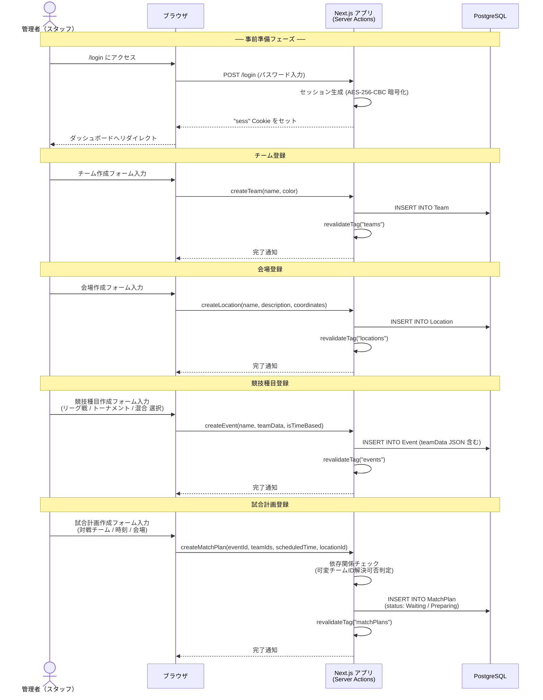
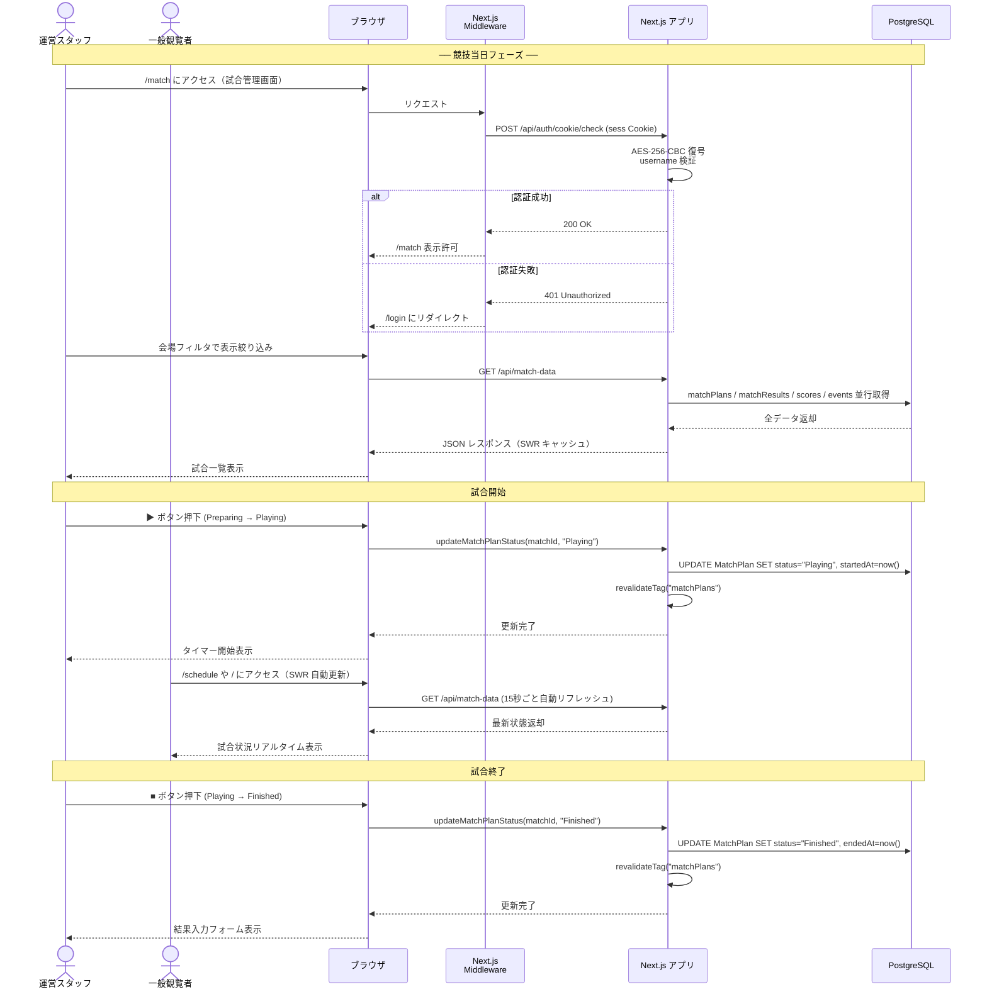
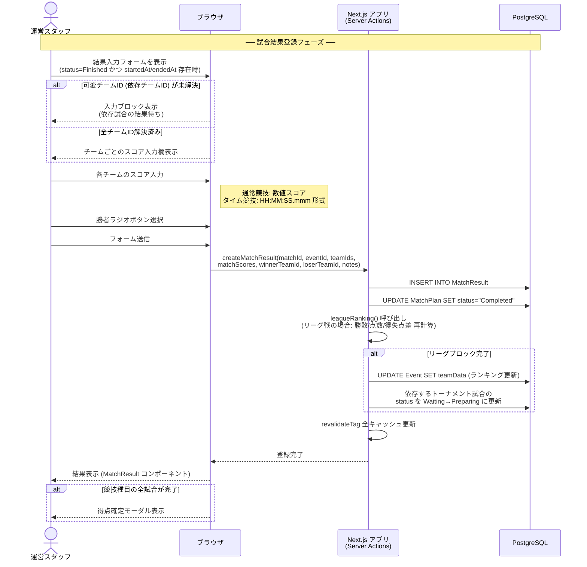
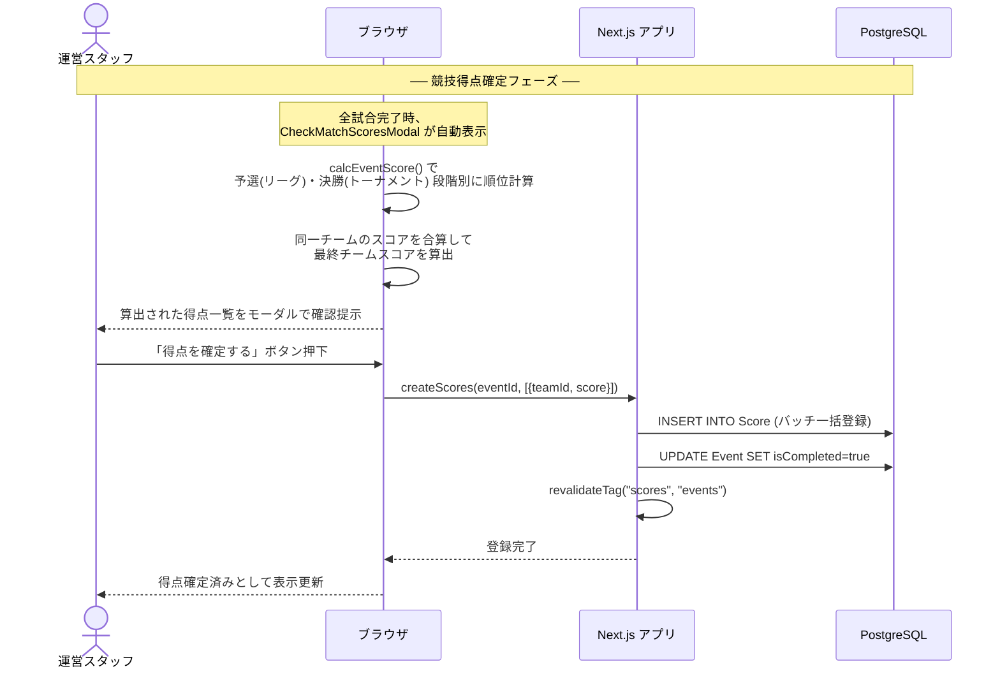
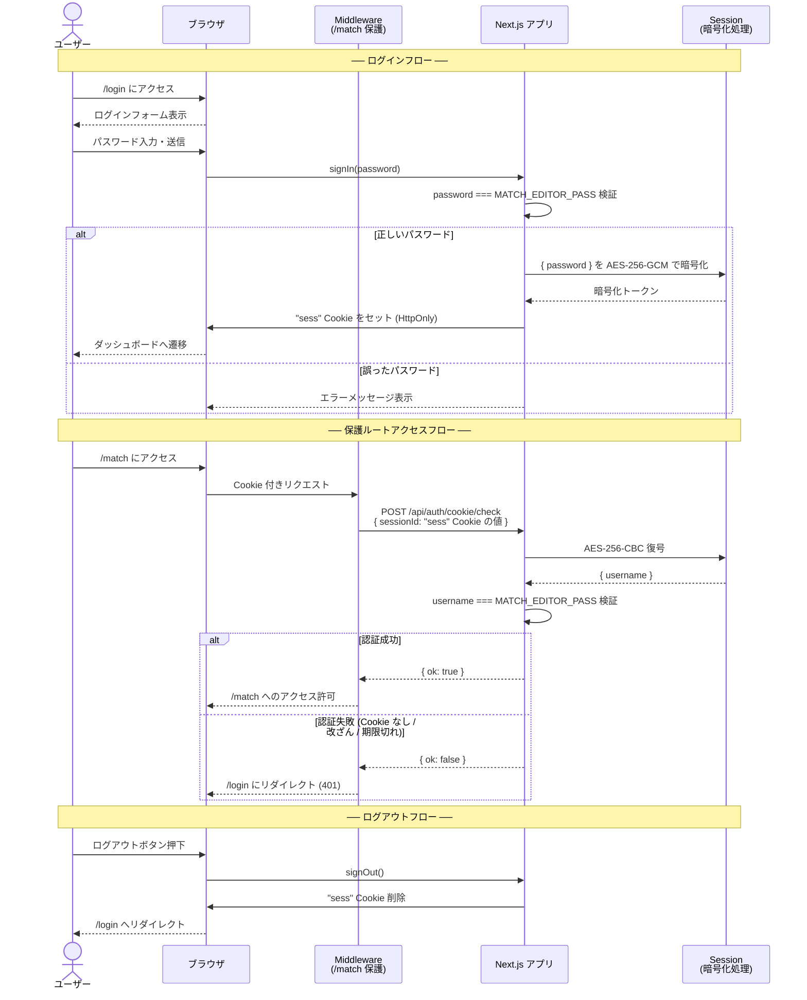

# NITIC Sports 来年度版 要件定義書

> 作成日: 2026-03-21  
> 対象システム: NITIC Sports（高専体育大会 競技管理 Web アプリケーション）  
> 本書は現行システム（nitic-sports）の実装を分析し、次年度版システムの要件を定義したものです。

---

## 目次

1. [システム概要](#1-システム概要)
2. [運用フロー](#2-運用フロー)
   - 2.1 [大会準備フロー（事前設定）](#21-大会準備フロー事前設定)
   - 2.2 [当日運用フロー（競技進行）](#22-当日運用フロー競技進行)
   - 2.3 [試合結果登録フロー](#23-試合結果登録フロー)
   - 2.4 [競技得点確定フロー](#24-競技得点確定フロー)
   - 2.5 [認証フロー](#25-認証フロー)
3. [非機能要件](#3-非機能要件)
4. [機能要件](#4-機能要件)
   - 4.1 [認証・認可](#41-認証認可)
   - 4.2 [チーム管理](#42-チーム管理)
   - 4.3 [競技種目管理](#43-競技種目管理)
   - 4.4 [試合計画管理](#44-試合計画管理)
   - 4.5 [試合結果登録](#45-試合結果登録)
   - 4.6 [会場管理](#46-会場管理)
   - 4.7 [得点管理](#47-得点管理)
   - 4.8 [公開情報表示](#48-公開情報表示)
   - 4.9 [管理ダッシュボード](#49-管理ダッシュボード)
5. [現行システムの課題と改善提案](#5-現行システムの課題と改善提案)

---

## 1. システム概要

NITIC Sports は、高専体育大会の競技進行をリアルタイムで管理・公開する Web アプリケーションである。

| 項目 | 内容 |
|------|------|
| システム名 | NITIC Sports |
| 対象イベント | 高専体育大会（複数日開催） |
| 利用者 | ① 一般参加者・観覧者（閲覧のみ） ② 競技運営スタッフ（試合進行管理） |
| 主要機能 | 試合進行管理 / リーグ戦・トーナメント対応 / 得点集計 / 会場マップ / 日程表示 |
| 技術スタック（現行） | Next.js 15 (App Router) / React 19 / TypeScript / Prisma 6 / PostgreSQL / Tailwind CSS / SWR |

---

## 2. 運用フロー

### 2.1 大会準備フロー（事前設定）

大会開催前に管理者がシステムに必要なマスタデータを登録する。

---

### 2.2 当日運用フロー（競技進行）

大会当日、運営スタッフが試合を進行させ、状態を逐次更新する。

---

### 2.3 試合結果登録フロー

試合終了後、スコアを入力して結果を確定させる。

---

### 2.4 競技得点確定フロー

競技種目の全試合終了後、最終順位・得点を確定させる。

---

### 2.5 認証フロー

---

## 3. 非機能要件

### 3.1 パフォーマンス要件

| 要件ID | 要件名 | 要件内容 | 備考 |
|--------|--------|---------|------|
| NF-P01 | ページ初回ロード | 初回ページ表示を 3 秒以内とする | LCP 基準 |
| NF-P02 | API レスポンス | REST API エンドポイントの応答を 1 秒以内とする | 通常時 |
| NF-P03 | データ自動更新 | 一般公開ページのデータを最大 15 秒の遅延でリアルタイム反映する | SWR refreshInterval |
| NF-P04 | バッチ取得 | `/api/match-data` にて matchPlans・matchResults・scores・events を並列取得し、逐次フェッチによる遅延（データフェッチのウォーターフォール問題）を防ぐ | 現行実装準拠 |
| NF-P05 | キャッシュ | Next.js のサーバーサイドキャッシュ（`revalidateTag`）を活用し、データベースへの不要なアクセスを抑制する | |

### 3.2 セキュリティ要件

| 要件ID | 要件名 | 要件内容 | 備考 |
|--------|--------|---------|------|
| NF-S01 | 認証方式 | 管理機能へのアクセスは Cookie ベースのセッション認証で保護する | |
| NF-S02 | セッション暗号化 | セッション情報は AES-256-GCM（認証付き暗号化）で暗号化して保存する。現行の AES-256-CBC はパディングオラクル攻撃に脆弱なため移行する | SESSION_KEY / SESSION_IV 環境変数使用 |
| NF-S03 | ルート保護 | `/match` 以下の全パスに対し、Middleware による認証チェックを行う | |
| NF-S04 | 環境変数管理 | パスワード・暗号鍵等の機密情報は環境変数で管理し、ソースコードに含めない | |
| NF-S05 | 入力バリデーション | サーバーサイドで Zod を用いた入力スキーマ検証を実施する | |
| NF-S06 | HTTPS 強制 | 本番環境では全通信を HTTPS で行う | |
| NF-S07 | パスワード強度 | 管理者パスワードは十分な複雑性 (英数字記号混在 12 文字以上) を要求する | 運用ガイドライン |

### 3.3 可用性・信頼性要件

| 要件ID | 要件名 | 要件内容 | 備考 |
|--------|--------|---------|------|
| NF-A01 | 稼働時間 | 大会開催日（最大 2 日間）は 99% 以上の稼働率を確保する | |
| NF-A02 | データ整合性 | 試合結果登録・得点確定はトランザクション処理で原子性を保証する | Prisma トランザクション |
| NF-A03 | 障害復旧 | データベース障害時は最後の正常状態に 1 時間以内に復旧できること | |
| NF-A04 | バックアップ | 大会開催日には 1 日 1 回以上データベースバックアップを取得する | |

### 3.4 スケーラビリティ要件

| 要件ID | 要件名 | 要件内容 | 備考 |
|--------|--------|---------|------|
| NF-SC01 | 同時接続数 | 一般閲覧者 200 名の同時アクセスに対応する | |
| NF-SC02 | データ量 | チーム数 50 以上・試合数 200 以上・競技種目 20 以上に対応する | |
| NF-SC03 | 会場数 | 最大 10 会場に対応する | |

### 3.5 保守性要件

| 要件ID | 要件名 | 要件内容 | 備考 |
|--------|--------|---------|------|
| NF-M01 | コード品質 | ESLint / Biome による静的解析を CI で実施する | |
| NF-M02 | 型安全性 | TypeScript の strict モードを有効にし、型エラーをビルド前に検出する | |
| NF-M03 | スキーマ管理 | Prisma によるスキーマバージョン管理を行い、マイグレーションを追跡可能にする | |
| NF-M04 | テスト | 主要なビジネスロジック（リーグランキング計算・可変チームID解決・得点計算）に対してユニットテストを整備する | 現行では未整備 |
| NF-M05 | ドキュメント | API・データモデル・環境変数の仕様をドキュメント化する | |

### 3.6 ユーザビリティ要件

| 要件ID | 要件名 | 要件内容 | 備考 |
|--------|--------|---------|------|
| NF-U01 | レスポンシブ対応 | スマートフォン（幅 375px 以上）からデスクトップまで対応する | |
| NF-U02 | 試合状態の視認性 | 試合ステータス（Waiting/Preparing/Playing/Finished/Completed）をカード枠色・バッジで即座に判別できる | |
| NF-U03 | 操作ミス防止 | 試合結果の上書き・削除など破壊的操作には確認ダイアログを表示する | |
| NF-U04 | オフライン通知 | ネットワーク断線時にユーザーへ通知を表示する | |

---

## 4. 機能要件

### 4.1 認証・認可

| 要件ID | 機能名 | 要件内容 | 優先度 |
|--------|--------|---------|--------|
| F-AU01 | ログイン | 管理者パスワードを入力して認証を行い、暗号化 Cookie セッションを発行する | 必須 |
| F-AU02 | ログアウト | セッション Cookie を削除し、ログインページへリダイレクトする | 必須 |
| F-AU03 | ルート保護 | `/match` 配下へのアクセスを認証済みセッションのみに制限する | 必須 |
| F-AU04 | セッション検証 | Cookie の復号・ユーザー名照合により有効なセッションか検証する | 必須 |

### 4.2 チーム管理

| 要件ID | 機能名 | 要件内容 | 優先度 |
|--------|--------|---------|--------|
| F-TM01 | チーム一覧表示 | 登録済みチームの一覧（ID・名称・カラー）を表示する | 必須 |
| F-TM02 | チーム作成 | チーム名・表示カラーを指定して新規チームを登録する | 必須 |
| F-TM03 | チーム編集 | チーム名・カラーを変更する | 必須 |
| F-TM04 | チーム削除 | 試合に紐付いていないチームを削除する | 推奨 |

### 4.3 競技種目管理

| 要件ID | 機能名 | 要件内容 | 優先度 |
|--------|--------|---------|--------|
| F-EV01 | 種目一覧表示 | 競技種目の一覧（ID・名称・完了状態）を表示する | 必須 |
| F-EV02 | 種目作成 | 種目名・チーム構成データ（リーグ/トーナメント/混合形式）・タイム競技フラグを設定して作成する | 必須 |
| F-EV03 | 種目編集 | 種目名・説明・チーム構成データを変更する | 必須 |
| F-EV04 | 種目完了設定 | 全試合終了後に種目を「完了」状態にする（手動・自動両対応） | 必須 |
| F-EV05 | 種目削除 | 試合計画・得点が紐付いていない種目を削除する | 推奨 |
| F-EV06 | リーグ形式対応 | ブロック分けリーグ戦に対応する（複数ブロック可、勝点・得失点差・順位計算） | 必須 |
| F-EV07 | トーナメント形式対応 | シングルエリミネーション・トーナメントブラケットに対応する | 必須 |
| F-EV08 | 混合形式対応 | リーグ戦予選 → トーナメント決勝のハイブリッド形式に対応する | 必須 |
| F-EV09 | タイム競技対応 | スコアを `HH:MM:SS.mmm` 形式のタイムとして扱う競技（陸上等）に対応する | 必須 |

### 4.4 試合計画管理

| 要件ID | 機能名 | 要件内容 | 優先度 |
|--------|--------|---------|--------|
| F-MP01 | 試合計画一覧表示 | 全試合の一覧（試合名・種目・会場・時間・状態）を表示する | 必須 |
| F-MP02 | 試合計画作成 | 種目・対戦チーム・開始/終了予定時刻・会場・試合名を指定して試合を作成する | 必須 |
| F-MP03 | 試合計画編集 | 試合の各項目を変更する | 必須 |
| F-MP04 | 試合計画削除 | 試合計画を削除する | 必須 |
| F-MP05 | 可変チームID | `$T-{matchId}-W/L`（試合勝者/敗者）や `$L-{eventId}-{blockIdx}-{blockName}-{rank}`（リーグ順位）で対戦チームを動的参照できる | 必須 |
| F-MP06 | 依存関係自動解決 | 可変チームIDを持つ試合は、参照先試合の結果確定後に自動的に `Waiting→Preparing` へ遷移させる | 必須 |
| F-MP07 | 状態管理 | 試合ステータスを `Waiting / Preparing / Playing / Finished / Completed / Cancelled` の 6 状態で管理する | 必須 |
| F-MP08 | 試合開始記録 | 試合開始時に `startedAt` タイムスタンプを自動記録する | 必須 |
| F-MP09 | 試合終了記録 | 試合終了時に `endedAt` タイムスタンプを自動記録する | 必須 |
| F-MP10 | 決勝フラグ | 試合に「決勝」「3位決定戦」フラグを付与できる | 必須 |
| F-MP11 | 備考欄 | 試合ごとに公開メモ・非公開メモを記録できる | 推奨 |

### 4.5 試合結果登録

| 要件ID | 機能名 | 要件内容 | 優先度 |
|--------|--------|---------|--------|
| F-MR01 | 結果入力フォーム | `status=Finished` かつ `startedAt/endedAt` 存在時にのみ入力フォームを表示する | 必須 |
| F-MR02 | スコア入力 | チームごとにスコア（数値またはタイム）を入力する | 必須 |
| F-MR03 | タイム入力 | タイム競技では HH/MM/SS/mmm の 4 フィールド分割入力を提供する | 必須 |
| F-MR04 | 勝者選択 | ラジオボタンで勝者チームを選択し、2 チーム戦では敗者を自動決定する | 必須 |
| F-MR05 | 依存チェック | 可変チームIDが未解決の場合は入力をブロックし、依存試合結果待ちである旨を表示する | 必須 |
| F-MR06 | 結果確定 | 結果登録と同時に試合ステータスを `Completed` に更新する | 必須 |
| F-MR07 | リーグ順位自動更新 | 結果登録後、当該ブロックの全チームのリーグ順位（勝点・得失点差・勝敗数）を再計算する | 必須 |
| F-MR08 | 結果編集 | 登録済みの結果を修正できる | 必須 |
| F-MR09 | 結果削除 | 登録済みの結果を削除し、試合ステータスを戻せる | 推奨 |
| F-MR10 | 結果備考 | 公開・非公開のメモを結果に付記できる（例：「じゃんけんで決定」） | 推奨 |

### 4.6 会場管理

| 要件ID | 機能名 | 要件内容 | 優先度 |
|--------|--------|---------|--------|
| F-LO01 | 会場一覧表示 | 登録済み会場の一覧を表示する | 必須 |
| F-LO02 | 会場作成 | 会場名・説明・座標を設定して新規会場を作成する | 必須 |
| F-LO03 | 会場編集 | 会場情報を変更する | 必須 |
| F-LO04 | 会場削除 | 試合に紐付いていない会場を削除する | 推奨 |
| F-LO05 | 会場マップ表示 | 会場の位置を画像マップ上に表示し、タップで詳細を表示できる（公開） | 必須 |
| F-LO06 | 試合フィルタ | 管理画面で会場別に試合一覧を絞り込む | 必須 |

### 4.7 得点管理

| 要件ID | 機能名 | 要件内容 | 優先度 |
|--------|--------|---------|--------|
| F-SC01 | 種目別順位計算 | 予選(リーグ)・決勝(トーナメント)の各フェーズの順位から種目得点を自動計算する | 必須 |
| F-SC02 | 得点確定 | 管理者が確認後にチームごとの種目得点を一括確定する | 必須 |
| F-SC03 | 総合得点集計 | 全種目の確定得点を合算し、チーム総合順位を算出・表示する | 必須 |
| F-SC04 | タイム競技対応 | タイム競技では最良タイムに基づいてチーム順位を決定する | 必須 |

### 4.8 公開情報表示

| 要件ID | 機能名 | 要件内容 | 優先度 |
|--------|--------|---------|--------|
| F-PU01 | ホームページ | 大会名・日程・日程表・会場マップへのリンクを表示するトップページを提供する | 必須 |
| F-PU02 | 日程表示 | 大会スケジュール（競技種目・時刻）を日付別に表示する | 必須 |
| F-PU03 | 会場マップ | 会場の位置情報をインタラクティブマップ上に表示し、南北エリア対応で会場詳細をモーダル表示する | 必須 |
| F-PU04 | リアルタイム更新 | 一般公開ページのデータを定期的に自動更新する（SWR: 最大 15 秒間隔） | 必須 |
| F-PU05 | リーグ表表示 | リーグ戦の現在の順位表（順位・勝敗・勝点・得失点差）を表示する | 必須 |
| F-PU06 | トーナメント表示 | トーナメントブラケットを視覚的に表示する | 必須 |
| F-PU07 | 試合検索 | チーム名や種目名で試合を検索できる | 推奨 |
| F-PU08 | 時計表示 | 現在時刻をリアルタイムで表示する | 推奨 |

### 4.9 管理ダッシュボード

| 要件ID | 機能名 | 要件内容 | 優先度 |
|--------|--------|---------|--------|
| F-DA01 | 試合管理画面 | 会場フィルタ付きの試合一覧・状態管理・結果入力を一画面で提供する（`/match`） | 必須 |
| F-DA02 | 同期スクロール | 複数会場の試合カードを同期してスクロールする | 推奨 |
| F-DA03 | 管理ダッシュボード | 種目・試合計画・チーム・総合得点の概要を一覧表示する（`/dashboard`） | 必須 |
| F-DA04 | 得点確定モーダル | 種目完了時に順位・得点の確認モーダルを自動表示し、得点確定操作を提供する | 必須 |
| F-DA05 | キャッシュ手動更新 | データの強制リフレッシュボタンを管理画面に提供する | 推奨 |

---

## 5. 現行システムの課題と改善提案

以下は現行システムの実装から抽出した課題と、次年度版での改善提案である。

| 課題 | 現状 | 改善提案 | 優先度 |
|------|------|---------|--------|
| テストが存在しない | ユニットテスト・E2E テスト未整備 | Vitest によるユニットテスト（ビジネスロジック）・Playwright による E2E テストを整備する | 高 |
| シングル管理者のみ | パスワード 1 本での認証 | ロールベースアクセス制御 (RBAC) の導入（管理者・会場担当者等） | 中 |
| チーム・会場削除 UI が無効化 | 削除ボタンがコメントアウト | 安全な削除機能を実装する（関連データ存在チェック付き） | 中 |
| スケジュールが日付・画像ハードコード | `judgeDay12.ts` に大会日付がハード埋め込み、スケジュール画面も静的画像に依存 | 日程・スケジュール情報をデータベースで管理し、動的に表示する | 高 |
| エラーハンドリング不足 | Server Actions でのエラー処理が最小限 | ユーザーへのエラーフィードバック強化・エラーログ収集基盤の整備 | 高 |
| セッション有効期限なし | Cookie に有効期限設定なし | セッション有効期限（例: 12 時間）と自動延長を実装する | 中 |
| 試合結果の上書き確認なし | 結果を上書きする際に確認なし | 破壊的操作への確認ダイアログの追加 | 中 |
| 型安全性の部分的欠如 | `teamData` が `Json[]` 型 | teamData の型定義を厳密化（Zod スキーマ + Prisma 型生成） | 中 |
| CSP / セキュリティヘッダー未設定 | next.config にセキュリティヘッダーなし | Content-Security-Policy 等のセキュリティヘッダーを設定する | 高 |
| CI/CD パイプラインなし | 自動デプロイ・テスト未整備 | GitHub Actions による CI（lint・test・build）と CD パイプラインの構築 | 中 |
